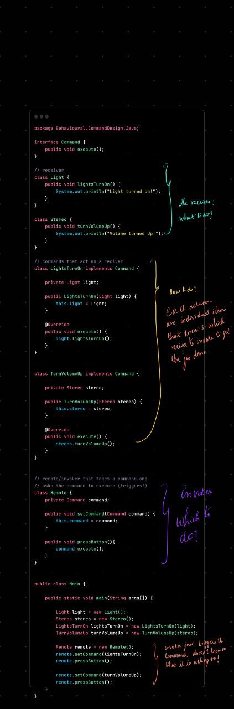

You're flying through the behavioral patterns — and now comes one of the **most powerful and versatile**:

# 🧠 **Command Design Pattern**

---

## 🔑 Quick Definition:

> **Command Pattern** turns a **request** into a **standalone object** that contains all the information needed to execute it — **when**, **where**, and **how**.

---

## 📦 Real-Life Analogy:

Imagine a **TV remote**:

* Button = command object
* TV = receiver
* Pressing a button = invoking the command

The remote (invoker) doesn’t know how the TV works — it just sends commands like `PowerOn`, `VolumeUp`, etc.

---

## ✅ Structure

### 1. **Command Interface**

```java
interface Command {
    void execute();
}
```

### 2. **Receiver (does the actual work)**

```java
class Light {
    public void turnOn() {
        System.out.println("Light is ON");
    }

    public void turnOff() {
        System.out.println("Light is OFF");
    }
}
```

### 3. **Concrete Commands**

```java
class TurnOnCommand implements Command {
    private Light light;

    public TurnOnCommand(Light light) {
        this.light = light;
    }

    public void execute() {
        light.turnOn();
    }
}

class TurnOffCommand implements Command {
    private Light light;

    public TurnOffCommand(Light light) {
        this.light = light;
    }

    public void execute() {
        light.turnOff();
    }
}
```

### 4. **Invoker (button/remote)**

```java
class RemoteControl {
    private Command command;

    public void setCommand(Command command) {
        this.command = command;
    }

    public void pressButton() {
        command.execute();
    }
}
```

### 5. **Client (puts it all together)**

```java
public class Main {
    public static void main(String[] args) {
        Light livingRoomLight = new Light();

        Command onCommand = new TurnOnCommand(livingRoomLight);
        Command offCommand = new TurnOffCommand(livingRoomLight);

        RemoteControl remote = new RemoteControl();

        remote.setCommand(onCommand);
        remote.pressButton(); // Light is ON

        remote.setCommand(offCommand);
        remote.pressButton(); // Light is OFF
    }
}
```

---

## 💡 Why Use Command Pattern?

| Benefit                        | Why it's useful                           |
| ------------------------------ | ----------------------------------------- |
| ✅ Decouples invoker from logic | Remote doesn’t know what it’s controlling |
| ✅ Enables **undo/redo**        | Store history of commands                 |
| ✅ Can be **queued or logged**  | Delayed or repeatable execution           |
| ✅ Supports **macros**          | Combine multiple commands into one        |

---

## 🧠 When to Use It

* Need to **decouple** the object that sends a request from the one that handles it
* You want **undo**, **redo**, or **replay** functionality
* Want to **log, queue, or schedule** actions
* GUI toolbars, buttons, or menu actions

---

## 🔥 Real-World Examples

* GUI: Button click handlers
* Thread Pools: Runnable = Command
* Task Schedulers
* Transaction Logs (DB undo/redo)
* Game Engines (replay moves)

---

## ❌ When NOT to Use

* If all commands are one-liners and don’t vary — it can over-engineer simple logic
---

## ✅ TL;DR Summary

| Role                | What it Does                        |
| ------------------- | ----------------------------------- |
| **Command**         | Interface for executing logic       |
| **ConcreteCommand** | Wraps real logic and calls receiver |
| **Receiver**        | Does the actual job                 |
| **Invoker**         | Calls `command.execute()`           |
| **Client**          | Sets up everything                  |

---

## 🔄 **Undo / Redo / Replay** in the Command Pattern

These are **behavioral features** that **naturally fit** into the Command pattern.

---

### 🧠 Why?

Because when you wrap actions (like "cut", "paste", "draw line") inside **Command objects**, you can **store them**, and later:

* **Undo** = reverse the action
* **Redo** = re-execute the action
* **Replay** = run a sequence again (like a macro or game replay)

---

# ✏️ Simple Text Editor with Undo/Redo (Command Pattern)

We'll model a basic editor that supports:

- Typing text
- Undo last command
- Redo last undone command

---

## ✅ 1. **Command Interface**

```java
interface Command {
    void execute();
    void undo();
}
```

---

## ✅ 2. **Receiver (Text Editor)**

```java
class TextEditor {
    private StringBuilder text = new StringBuilder();

    public void append(String str) {
        text.append(str);
    }

    public void removeLast(int count) {
        int length = text.length();
        if (count <= length) {
            text.delete(length - count, length);
        }
    }

    public String getText() {
        return text.toString();
    }
}
```

---

## ✅ 3. **Concrete Command: TypeCommand**

```java
class TypeCommand implements Command {
    private TextEditor editor;
    private String typedText;

    public TypeCommand(TextEditor editor, String text) {
        this.editor = editor;
        this.typedText = text;
    }

    public void execute() {
        editor.append(typedText);
    }

    public void undo() {
        editor.removeLast(typedText.length());
    }
}
```

---

## ✅ 4. **Invoker (EditorInvoker)**

Handles command history and undo/redo stacks.

```java
import java.util.*;

class EditorInvoker {
    private Stack<Command> undoStack = new Stack<>();
    private Stack<Command> redoStack = new Stack<>();

    public void executeCommand(Command command) {
        command.execute();
        undoStack.push(command);
        redoStack.clear(); // Invalidate redo after new command
    }

    public void undo() {
        if (!undoStack.isEmpty()) {
            Command cmd = undoStack.pop();
            cmd.undo();
            redoStack.push(cmd);
        }
    }

    public void redo() {
        if (!redoStack.isEmpty()) {
            Command cmd = redoStack.pop();
            cmd.execute();
            undoStack.push(cmd);
        }
    }
}
```

---

## ✅ 5. **Main Program (Client)**

```java
public class Main {
    public static void main(String[] args) {
        TextEditor editor = new TextEditor();
        EditorInvoker invoker = new EditorInvoker();

        invoker.executeCommand(new TypeCommand(editor, "Hello "));
        invoker.executeCommand(new TypeCommand(editor, "World"));
        System.out.println("Text: " + editor.getText()); // Hello World

        invoker.undo();
        System.out.println("After Undo: " + editor.getText()); // Hello

        invoker.redo();
        System.out.println("After Redo: " + editor.getText()); // Hello World

        invoker.executeCommand(new TypeCommand(editor, "!!"));
        System.out.println("After Typing !!: " + editor.getText()); // Hello World!!

        invoker.undo();
        invoker.undo();
        System.out.println("After 2 Undos: " + editor.getText()); // Hello
    }
}
```
## 🔑 Bottom Line:

> **Command pattern** allows you to treat actions as objects.
> Once actions are objects, you can:
>
> * **Execute**
> * **Undo**
> * **Redo**
> * **Log**
> * **Replay**

All by just calling methods on stored command instances.
---

### Summary


+ “Command Pattern lets me wrap a actions like `turnOnLight()` into a separate object. The object contains all data needed to run it later, log it, undo it, or queue it.
+ It decouples the sender (like a button) from the receiver (like a light), making it flexible and extensible.”
+ Decouples "What to do "(command), "How to do"(receiver), and "which to do" (remote)

### code walkthrough


