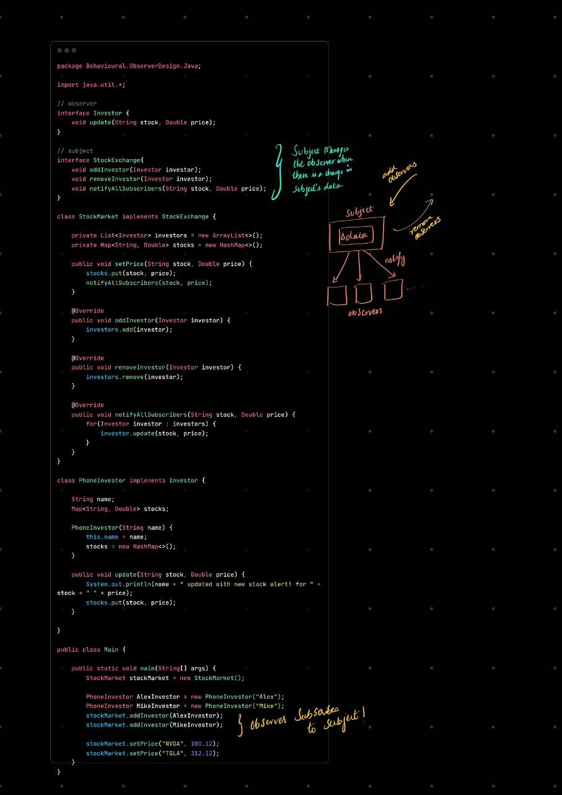

---

# 👀 Observer Design Pattern

### ✅ “When one changes, all others should know.”

---

## 💡 Definition:

The **Observer Pattern** defines a **one-to-many dependency** between objects so that when one object (the **Subject**) changes state, all its **Observers** are notified and updated automatically.

---

## 🧠 Core Idea:

> You separate the **thing being watched** from the **things watching it**.

---

## ✅ Key Components:

| Role                 | Description                                           |
| -------------------- | ----------------------------------------------------- |
| **Subject**          | The object being observed (e.g., StockMarket)         |
| **Observer**         | The object that wants to be notified (e.g., Investor) |
| **ConcreteSubject**  | Real class that tracks state & observers              |
| **ConcreteObserver** | Real class that responds to state changes             |

---

## 📦 When to Use It

✅ Use Observer Pattern when:

* You have one object that changes often (like data or events)
* You want multiple other objects to **respond automatically**
* You want to **avoid tight coupling** between source and listeners

---

## ❌ When **Not** to Use

* Only one observer exists (no benefit)
* State rarely changes
* You want strict control over who gets notified
* You need total decoupling (then consider an EventBus / pub-sub)

---

## 🔁 Pull vs Push Model

| Model | What Happens                                      |
| ----- | ------------------------------------------------- |
| Push  | Subject sends full data to observer               |
| Pull  | Observer gets minimal info, fetches what it needs |

---

## 🧠 In Interviews Say:

> “Observer lets one object notify many others when its state changes, without knowing who they are. I’ve used it for things like UI updates, event systems, stock tickers, or real-time dashboards.”

---

## 🛠 Alternatives in Real Projects

| Pattern / Tool                  | Difference / When to Use             |
| ------------------------------- | ------------------------------------ |
| **EventBus / RxJava / Streams** | More decoupled, reactive programming |
| **Mediator**                    | For many-to-many object interaction  |
| **Pub-Sub (Kafka, Redis)**      | Cross-system observer pattern        |

---

## 🧠 TL;DR

| Concept  | Quick Summary                     |
| -------- | --------------------------------- |
| Observer | Watches changes in subject        |
| Subject  | Notifies observers of changes     |
| Benefit  | Decouples source from reactions   |
| Use case | UI, stock alerts, messaging, logs |

---

### Code Walkthrough

### Summary

defines a **one-to-many dependency** between objects so that when one object (the **Subject**) changes state, all its **Observers** are notified and updated automatically.