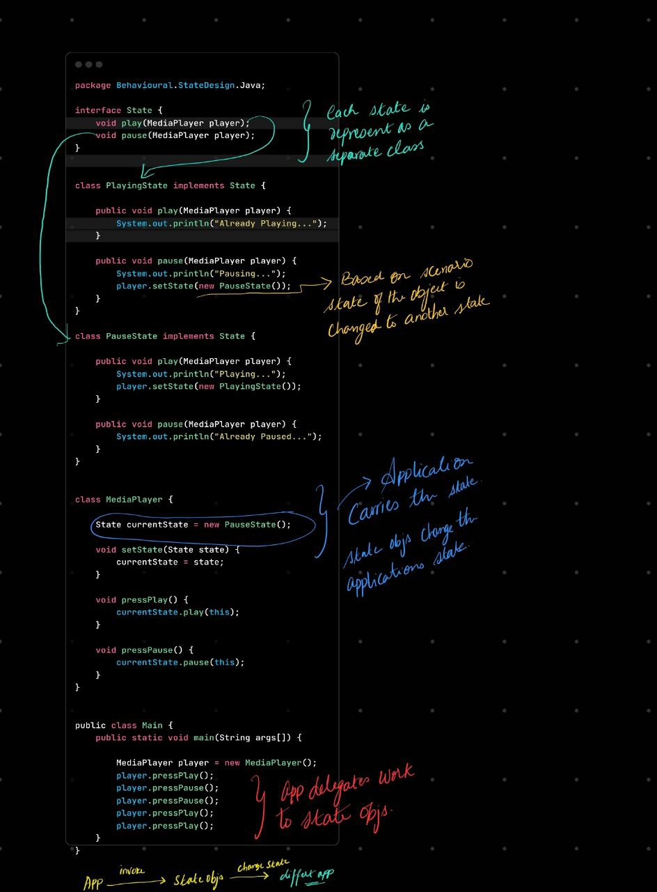

---

## 🌀 What is the **State Design Pattern**?

The State pattern allows an object to **alter its behavior** when its **internal state changes**, making it appear as if it has changed its class.

---

## 🔑 Key Ideas

* Object behavior depends on its **current state**
* Instead of using `if-else` or `switch`, move state-specific behavior into **separate classes**
* The object holds a **reference to a state object**, and delegates work to it

---

## 🧠 Analogy

Think of a **Media Player** or an **ATM**:

* In `Paused` state, pressing play starts music
* In `Playing` state, pressing pause stops music

The same button behaves **differently** depending on state.

---

## 🧱 Pattern Structure

* **Context**: The object whose behavior changes (e.g. MediaPlayer, ATM)
* **State Interface**: Declares the actions (e.g. `play()`, `pause()`)
* **Concrete States**: Implement the behavior for each specific state

---

## ✅ When to Use

Use State pattern when:

* You have an object with **multiple states**, and its **behavior varies by state**
* You want to eliminate long **if-else** or `switch` statements
* You want to follow the **Open/Closed Principle** — add new states without touching existing code

---

## ❌ When *Not* to Use

Avoid State pattern if:

* You only have 2–3 simple states
* State transitions are rare or trivial
* State logic is identical and doesn’t vary

---

## ✅ Benefits

| Benefit               | Why it matters                 |
| --------------------- | ------------------------------ |
| Clean code            | No long `if-else` chains       |
| Encapsulation         | Each state has its own logic   |
| Scalable              | Easy to add or change states   |
| Open/Closed Principle | New states don't affect others |

---

## ⚠️ Drawbacks

| Drawback                | Explanation                    |
| ----------------------- | ------------------------------ |
| More classes            | Each state is a separate class |
| State explosion         | Too many states if overused    |
| Can look overengineered | For simple state logic         |

---

## 💬 Interview Pitch (Simple)

> "The State pattern lets an object change its behavior when its internal state changes — without using messy `if-else` logic. Each state is handled by a separate class, and the context delegates work to its current state object. This keeps the code clean, modular, and scalable."

---

## 🤔 Common Examples

| Use Case       | States                         |
| -------------- | ------------------------------ |
| Media Player   | Playing, Paused, Stopped       |
| ATM Machine    | NoCard, HasCard, Authenticated |
| TCP Connection | Listening, Connected, Closed   |
| Traffic Light  | Red, Green, Yellow             |
| Online Order   | New, Shipped, Delivered        |

---

## 🔁 Tips

* Use **singleton instances** for stateless state objects (avoid too many `new`s)
* Let **states handle transitions**, not the context
* If states share behavior, use **inheritance or delegation**

---

## 🧠 Related Patterns

| Pattern   | Difference                                                  |
| --------- | ----------------------------------------------------------- |
| Strategy  | Behavior selection at runtime, but no internal state change |
| Command   | Encapsulates requests, not object state                     |
| Observer  | Notification pattern, not behavior change                   |
| Flyweight | Shares state, doesn’t change it                             |

---

## 📌 TL;DR

* **Purpose**: Change object behavior dynamically with its internal state
* **Avoids**: `if-else`, `switch-case` chains
* **Key Components**: Context, State interface, Concrete States
* **Best For**: UI flows, lifecycle management, games, workflows

---

### Code Walkthrough

### Summary

+ The State pattern allows an object to **alter its behavior** when its **internal state changes**, making it appear as if it has changed its class.
+ An object's behavior is determined by its current state.
+ Each state is implemented as a separate class, and the object delegates its actions to the current state object.
+ These state objects handle transitions by updating the object's state based on different scenarios.
+ avoids to many if else to change state