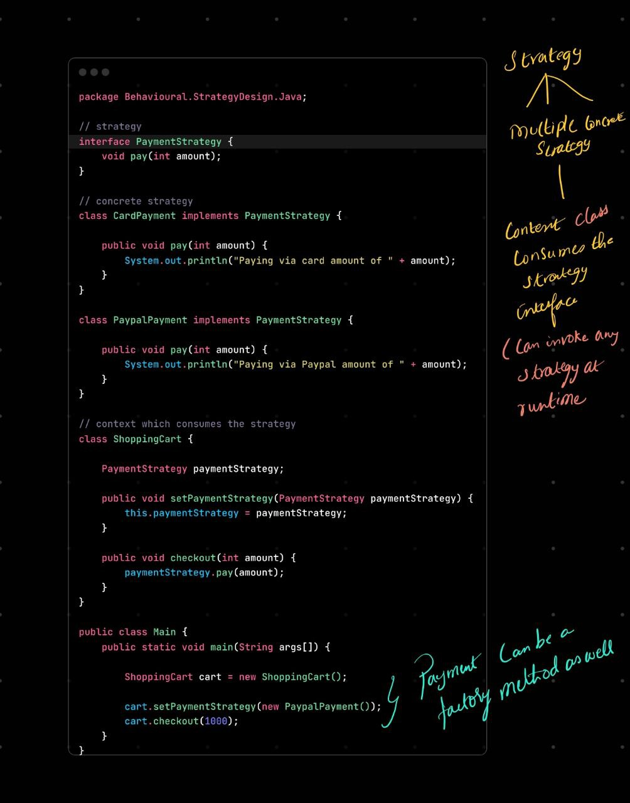

> 🎯 **Strategy Design Pattern**

---

## 🧠 What Is It?

> Strategy Pattern lets you define **a family of algorithms**, put them in separate classes, and make them **interchangeable at runtime**.

You separate the **"what to do"** from the **"how to do it"** — and inject different behaviors as needed.

---

## 📦 Real-Life Analogy

Imagine a **navigation app**:

* You can choose between:

  * 🚗 Car route
  * 🚲 Bike route
  * 🚶 Walk route

All these are **strategies** for "navigating" — the app uses one depending on context.

---

## ✅ Java Structure

### 1. Strategy Interface

```java
interface PaymentStrategy {
    void pay(int amount);
}
```

### 2. Concrete Strategies

```java
class CreditCardPayment implements PaymentStrategy {
    public void pay(int amount) {
        System.out.println("Paid " + amount + " with Credit Card");
    }
}

class PayPalPayment implements PaymentStrategy {
    public void pay(int amount) {
        System.out.println("Paid " + amount + " with PayPal");
    }
}
```

### 3. Context (uses the strategy)

```java
class ShoppingCart {
    private PaymentStrategy paymentStrategy;

    public void setPaymentStrategy(PaymentStrategy strategy) {
        this.paymentStrategy = strategy;
    }

    public void checkout(int amount) {
        paymentStrategy.pay(amount);
    }
}
```

### 4. Client Code (uses context)

```java
public class Main {
    public static void main(String[] args) {
        ShoppingCart cart = new ShoppingCart();

        cart.setPaymentStrategy(new CreditCardPayment());
        cart.checkout(500);  // Paid 500 with Credit Card

        cart.setPaymentStrategy(new PayPalPayment());
        cart.checkout(300);  // Paid 300 with PayPal
    }
}
```

---

## 💡 Key Characteristics

| Feature                     | Explanation                                            |
| --------------------------- | ------------------------------------------------------ |
| ✅ Replaces `if-else` blocks | You don’t write `if (payment == ...)`                  |
| ✅ Runtime flexibility       | You can switch strategy dynamically                    |
| ✅ Open/Closed principle     | Easily add new strategies without touching the context |

---

## 🧨 When NOT to Use

* If the behavior **never changes**
* If the variation is only **one or two lines**
* If it's **not reused**

---

## ✅ Use Strategy Pattern When:

* You have **many related classes** differing only in **behavior**
* You want to **switch behaviors dynamically**
* You want to **encapsulate algorithms**

---

## 🔥 TL;DR:

> Strategy pattern = Define multiple ways of doing something, and inject whichever you want — without modifying the core logic.

Absolutely — let's go through **multiple realistic examples** of the **Strategy Design Pattern** so you get a **solid mental model**.

---

## 🔁 Quick Recap:

> Strategy = Define a family of interchangeable behaviors (algorithms), **inject them at runtime**.

---

# ✅ Examples of Strategy Pattern

---

### 💳 1. **Payment Method (Classic)**

```java
interface PaymentStrategy {
    void pay(int amount);
}

class UPI implements PaymentStrategy {
    public void pay(int amount) {
        System.out.println("Paying ₹" + amount + " via UPI");
    }
}

class CreditCard implements PaymentStrategy {
    public void pay(int amount) {
        System.out.println("Paying ₹" + amount + " via Credit Card");
    }
}

class Checkout {
    private PaymentStrategy strategy;
    public Checkout(PaymentStrategy strategy) {
        this.strategy = strategy;
    }
    public void makePayment(int amount) {
        strategy.pay(amount);
    }
}
```

✅ Inject strategy:

```java
new Checkout(new UPI()).makePayment(300);
new Checkout(new CreditCard()).makePayment(1000);
```

---

### 🧹 2. **Sorting Algorithms**

```java
interface SortStrategy {
    void sort(int[] arr);
}

class BubbleSort implements SortStrategy {
    public void sort(int[] arr) {
        System.out.println("Sorting using Bubble Sort");
    }
}

class QuickSort implements SortStrategy {
    public void sort(int[] arr) {
        System.out.println("Sorting using Quick Sort");
    }
}
```

```java
class Sorter {
    private SortStrategy strategy;
    public Sorter(SortStrategy strategy) {
        this.strategy = strategy;
    }
    public void sortArray(int[] arr) {
        strategy.sort(arr);
    }
}
```

✅ Use:

```java
Sorter sorter = new Sorter(new QuickSort());
sorter.sortArray(new int[]{5, 3, 1});
```

---

### 🧠 3. **AI Behavior (in games)**

```java
interface EnemyStrategy {
    void move();
}

class Aggressive implements EnemyStrategy {
    public void move() {
        System.out.println("Charge toward player!");
    }
}

class Defensive implements EnemyStrategy {
    public void move() {
        System.out.println("Take cover and wait!");
    }
}

class Enemy {
    private EnemyStrategy strategy;
    public Enemy(EnemyStrategy strategy) {
        this.strategy = strategy;
    }

    public void act() {
        strategy.move();
    }
}
```

✅ Use:

```java
Enemy e = new Enemy(new Aggressive());
e.act(); // Charge toward player!
```

---

### 📦 4. **Compression Strategy (e.g. ZIP, RAR)**

```java
interface CompressionStrategy {
    void compress(String filename);
}

class ZipCompression implements CompressionStrategy {
    public void compress(String filename) {
        System.out.println("Compressing " + filename + " using ZIP");
    }
}

class RarCompression implements CompressionStrategy {
    public void compress(String filename) {
        System.out.println("Compressing " + filename + " using RAR");
    }
}
```

```java
class Compressor {
    private CompressionStrategy strategy;
    public Compressor(CompressionStrategy strategy) {
        this.strategy = strategy;
    }

    public void compressFile(String file) {
        strategy.compress(file);
    }
}
```

✅ Use:

```java
Compressor comp = new Compressor(new ZipCompression());
comp.compressFile("report.docx");
```

---

### 🕹 5. **Travel Mode (Maps App)**

```java
interface TravelMode {
    int calculateETA();  // returns minutes
    int calculateCost(); // returns rupees
}

class BikeMode implements TravelMode {
    public int calculateETA() { return 10; }
    public int calculateCost() { return 0; }
}

class TaxiMode implements TravelMode {
    public int calculateETA() { return 7; }
    public int calculateCost() { return 100; }
}
```

```java
class Navigator {
    private TravelMode mode;
    public Navigator(TravelMode mode) {
        this.mode = mode;
    }

    public void showTripDetails() {
        System.out.println("ETA: " + mode.calculateETA() + " mins");
        System.out.println("Cost: ₹" + mode.calculateCost());
    }
}
```

✅ Use:

```java
Navigator nav = new Navigator(new TaxiMode());
nav.showTripDetails();
```

---

## 💡 Key Things to Notice

* Each **strategy has its own class**
* The context (like `Navigator`, `Compressor`, etc.) is **decoupled** from specific logic
* Strategies can be **switched at runtime** or passed from config/injector

---

### Code Walkthrough



### Summary

“The Strategy Pattern lets me define different ways of doing the same task, and choose one at runtime — without changing the context class - the one that uses the strategy pattern”

“Let’s say I’m building a shopping app. Users can pay using Credit Card, UPI, or PayPal.
Instead of writing if-else inside the Checkout class, I use the Strategy pattern. I create one PaymentStrategy interface and separate classes for each payment method.
Then, I inject whichever strategy I need — clean and flexible.”