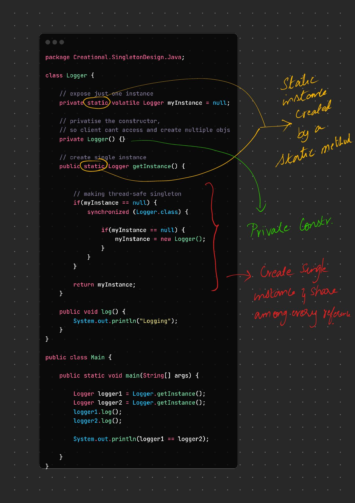

🔥 You got it. Here's **everything you need to know** about the **Singleton Design Pattern** — with **real-world clarity**, **when to use**, **how to implement it right**, and **common mistakes**.

---

## 🧠 What Is the Singleton Pattern?

> **Singleton ensures** that a class has **only one instance** in the JVM
> and provides a **global access point** to it.

So instead of:

```java
MyService s1 = new MyService();
MyService s2 = new MyService(); // ❌ Two different objects
```

You get:

```java
MyService s1 = MyService.getInstance();
MyService s2 = MyService.getInstance(); // ✅ Same object
```

---

## 🎯 When to Use Singleton (Practical Reasons)

| Use Case                   | Why Singleton Helps               |
| -------------------------- | --------------------------------- |
| ✅ Logging                  | Centralized logger instance       |
| ✅ Config/Settings manager  | Shared config across classes      |
| ✅ Database connection pool | One shared access point           |
| ✅ Caches                   | Global state needed across app    |
| ✅ Resource managers        | Limit access to GPU, memory, etc. |

---

## ❌ When *Not* to Use Singleton

| Situation                         | Why Singleton Hurts                 |
| --------------------------------- | ----------------------------------- |
| ❌ You need multiple instances     | Breaks flexibility                  |
| ❌ You want to unit test easily    | Singleton introduces hidden state   |
| ❌ You use it as a global variable | Bad design smells (tight coupling)  |
| ❌ Multithreading not handled      | Can lead to bugs if not thread-safe |

---

## ✅ Basic Structure (Java)

```java
public class MySingleton {
    private static MySingleton instance;

    private MySingleton() {
        // private constructor
    }

    public static MySingleton getInstance() {
        if (instance == null) {
            instance = new MySingleton();
        }
        return instance;
    }
}
```

---

## 🔥 But This Is *NOT* Thread-Safe!

Multiple threads could create multiple instances.

---

## ✅ Thread-Safe Singleton (Lazy Initialization + Synchronized)

```java
public class MySingleton {
    private static MySingleton instance;

    private MySingleton() {}

    public static synchronized MySingleton getInstance() {
        if (instance == null) {
            instance = new MySingleton();
        }
        return instance;
    }
}
```

But `synchronized` makes every call slower ⚠️

---

## 🚀 BEST VERSION: **Double-Checked Locking**

```java
public class MySingleton {
    private static volatile MySingleton instance;

    private MySingleton() {}

    public static MySingleton getInstance() {
        if (instance == null) {
            synchronized (MySingleton.class) {
                if (instance == null) {
                    instance = new MySingleton();
                }
            }
        }
        return instance;
    }
}
```

✅ Thread-safe
✅ Efficient
✅ Lazy-loaded

---

## 🧊 Simplest (but Eager) Singleton

```java
public class MySingleton {
    private static final MySingleton instance = new MySingleton();

    private MySingleton() {}

    public static MySingleton getInstance() {
        return instance;
    }
}
```

✅ Simple
❌ Eager (always created even if unused)

---

## 🧵 Best Modern Java Way: **Bill Pugh Singleton (Inner Static Class)**

```java
public class MySingleton {
    private MySingleton() {}

    private static class Holder {
        private static final MySingleton INSTANCE = new MySingleton();
    }

    public static MySingleton getInstance() {
        return Holder.INSTANCE;
    }
}
```

✅ Thread-safe
✅ Lazy
✅ No `synchronized`
✅ Cleanest & most recommended

---

## 🧪 Real-World Usage Examples

| Use Case         | Example                                |
| ---------------- | -------------------------------------- |
| Logger           | `Logger.getInstance().log("message");` |
| Config Reader    | `Config.getInstance().get("db_url");`  |
| DB ConnectionMgr | `DBPool.getInstance().acquire();`      |
| Caching Service  | `Cache.getInstance().get("user_123");` |

---

## ⚠️ Common Mistakes

| Mistake                          | Why It's Bad                       |
| -------------------------------- | ---------------------------------- |
| Making constructor public        | Anyone can make multiple instances |
| Forgetting thread safety         | Multiple threads can break it      |
| Treating everything as singleton | Overuse = tightly coupled code     |
| Not testing shared state changes | Hidden state = unpredictable bugs  |

---

## ✅ TL;DR for Notes

> Singleton ensures only **one instance exists** of a class and provides a **global access point** to it.

* Use when:

  * You need **only one object**
  * Shared across app (logger, config, db pool)
* Avoid when:

  * You need multiple instances
  * You care about testability
* Best versions:

  * ✅ Inner static holder (Bill Pugh way)
  * ✅ Double-checked locking for thread-safe lazy init

---


### Code Walkthrough

