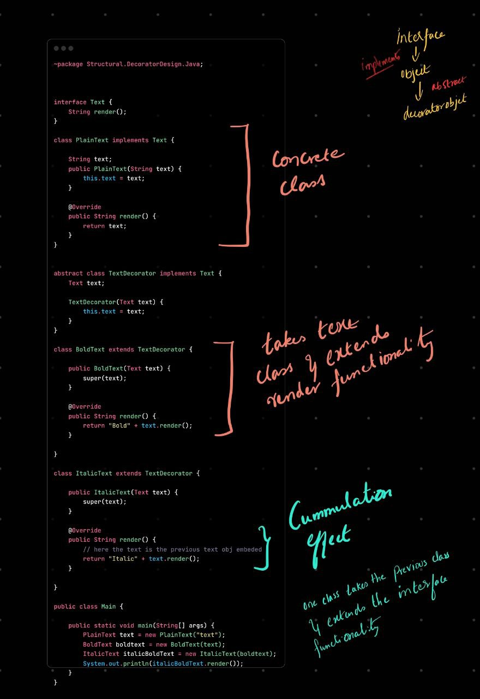

# 🧱 Decorator Design Pattern — All You Need to Know

---

## 🎯 What Is It?

The **Decorator Pattern** is used to **dynamically add new behavior** to objects **without modifying their structure**.

> Instead of subclassing or rewriting code, you *wrap* the original object with a decorator that enhances or alters its behavior.

---

## 🧠 Real-World Analogy

Think of a **coffee shop**:

* You order `Coffee`
* Then you add **Milk**, **Whip**, or **Mocha**

You’re not creating new coffee classes like `MilkCoffee`, `WhipMochaCoffee`, etc.

✅ You just wrap the base coffee with add-ons. That’s the decorator pattern.

---

## 🔧 Structure

```
Interface
   ↑
Component (Base)
   ↑
ConcreteComponent (Real Object)
   ↑
Decorator (wraps Component)
   ↑
ConcreteDecorator (adds behavior)
```

---

## 👨‍💻 Java Code Example: Coffee Customizer

### 1. 🎯 Base Interface

```java
interface Coffee {
    String getDescription();
    double cost();
}
```

---

### 2. ☕ Concrete Component (base object)

```java
class SimpleCoffee implements Coffee {
    public String getDescription() {
        return "Simple Coffee";
    }
    public double cost() {
        return 5.0;
    }
}
```

---

### 3. 🧩 Abstract Decorator

```java
abstract class CoffeeDecorator implements Coffee {
    protected Coffee coffee;
    public CoffeeDecorator(Coffee coffee) {
        this.coffee = coffee;
    }
}
```

---

### 4. ✅ Concrete Decorators (add behavior)

```java
class MilkDecorator extends CoffeeDecorator {
    public MilkDecorator(Coffee coffee) {
        super(coffee);
    }

    public String getDescription() {
        return coffee.getDescription() + ", Milk";
    }

    public double cost() {
        return coffee.cost() + 1.5;
    }
}

class WhipDecorator extends CoffeeDecorator {
    public WhipDecorator(Coffee coffee) {
        super(coffee);
    }

    public String getDescription() {
        return coffee.getDescription() + ", Whip";
    }

    public double cost() {
        return coffee.cost() + 0.8;
    }
}
```

---

### 5. ✅ Usage

```java
public class Main {
    public static void main(String[] args) {
        Coffee myCoffee = new SimpleCoffee();
        myCoffee = new MilkDecorator(myCoffee);    // add milk
        myCoffee = new WhipDecorator(myCoffee);    // add whip

        System.out.println(myCoffee.getDescription());
        System.out.println("Cost: $" + myCoffee.cost());
    }
}
```

🧾 Output:

```
Simple Coffee, Milk, Whip
Cost: $7.3
```

---

## ✅ When to Use Decorator

| Use Case                                                      | Why Decorator Helps                     |
| ------------------------------------------------------------- | --------------------------------------- |
| You want to add behavior **without modifying original class** | Safe & open-closed compliant            |
| You want to **combine features** at runtime                   | Like adding milk + whip dynamically     |
| You want **fine-grained control** over object behavior        | Prefer composition over inheritance     |
| You want to avoid creating tons of subclasses                 | No need for `BigCoffeeWithWhipAndSugar` |

---

## ❌ When NOT to Use

| Situation                                  | Better Approach                             |
| ------------------------------------------ | ------------------------------------------- |
| Behavior is static / known upfront         | Just use inheritance or strategy            |
| You need multiple unrelated behaviors      | Consider composition with separate services |
| The added logic needs deep object mutation | Use Proxy or manually decorate inside logic |

---

## ✅ Benefits

* ✔ Follows **Open-Closed Principle**
* ✔ No need to change existing code
* ✔ You can **stack decorators**
* ✔ Promotes **flexible, dynamic design**

---

## ❌ Drawbacks

* ❌ Can lead to **too many small classes**
* ❌ Object identity becomes **unclear** (you’re always wrapping)
* ❌ Debugging stack of decorators can be **hard**

---

## 🔁 Decorator vs Other Patterns

| Pattern       | Purpose                                      |
| ------------- | -------------------------------------------- |
| **Decorator** | Dynamically adds behavior to an object       |
| **Proxy**     | Controls access or adds security/caching     |
| **Adapter**   | Makes one interface work like another        |
| **Strategy**  | Swaps algorithms at runtime                  |
| **Builder**   | Helps construct complex objects step by step |

---

## 💡 Real-World Decorator Examples

| Context       | Decorator Example                                      |
| ------------- | ------------------------------------------------------ |
| Java IO       | `BufferedInputStream`, `DataInputStream`, etc.         |
| Logging       | Wrap loggers to add formatting, timestamps, filters    |
| UI Frameworks | Add borders, scrollbars, shadows to UI components      |
| Spring AOP    | Uses proxies (close cousin) to add logging/tx/security |

---

## 🧠 TL;DR

> The **Decorator Pattern** lets you **wrap objects with new behavior**, at runtime, without changing the original class — perfect for flexible enhancements.

🔥 Killer question — and you’re thinking like a real designer now.

You’re asking:

> “Why not just use **Builder Pattern** like: `coffee.addMilk().addWhip()`? Isn’t that cleaner?”

Let’s break it down properly 👇

---

## ⚔️ Decorator vs Builder — **What's the Real Difference?**

| Criteria               | **Builder Pattern**                                        | **Decorator Pattern**                                   |
| ---------------------- | ---------------------------------------------------------- | ------------------------------------------------------- |
| ✅ **When to use**      | When you want to **construct an object step-by-step**      | When you want to **add behavior to an existing object** |
| 🛠 **Purpose**         | Build a complex object with multiple configuration options | Wrap existing objects to extend behavior dynamically    |
| 🧱 **Output**          | Returns **a new fully built object**                       | Returns a **wrapped object with added behavior**        |
| 🕰 **When it applies** | At **object creation time**                                | At **runtime**, possibly **after object creation**      |
| 🔁 **Usage style**     | Fluent builder: `new Car.Builder().addGPS()`               | Wrapping: `new MilkDecorator(new SimpleCoffee())`       |

---

### 🥤 So for your **Coffee Example**:

If you do this:

```java
new CoffeeBuilder()
  .addMilk()
  .addWhip()
  .build();
```

✅ That’s a **Builder Pattern**.
You're building a **final product** with selected ingredients.

---

### But with Decorator:

```java
Coffee c = new WhipDecorator(new MilkDecorator(new SimpleCoffee()));
```

✅ You’re adding **runtime behavior**, not just setting values.
Each decorator can **override methods**, change `cost()`, `getDescription()`, even inject new logic dynamically.

---

## 🧠 Why Not Builder?

Because builder is good for:

* **Creating** objects
* With **configuration**
* But **not** for dynamically injecting **new logic or behavior** after creation.

---

## 🔥 When Decorator Wins Over Builder

| Situation                                          | Use Decorator |
| -------------------------------------------------- | ------------- |
| You want to **dynamically compose behaviors**      | ✅ Yes         |
| You want to **override methods** like `cost()`     | ✅ Yes         |
| You want to **swap or stack behaviors**            | ✅ Yes         |
| You want to just build a plain object with options | ❌ Use Builder |

---

## TL;DR:

> 🧠 **Use Builder** to **create an object with options**
> 🧠 **Use Decorator** to **add or modify behavior of an existing object at runtime**

---

### Code Walkthrough


### Summary
+ if you have created an object and if the user wants to add some more behaviour to the object dynamically during runtime. use Decorator pattern. 
+ an object servers a purpose, via an interface
+ The Decortor object takes and previous object and extends the interface method in addtion to the object method
+ this happens in cummulative fashion
