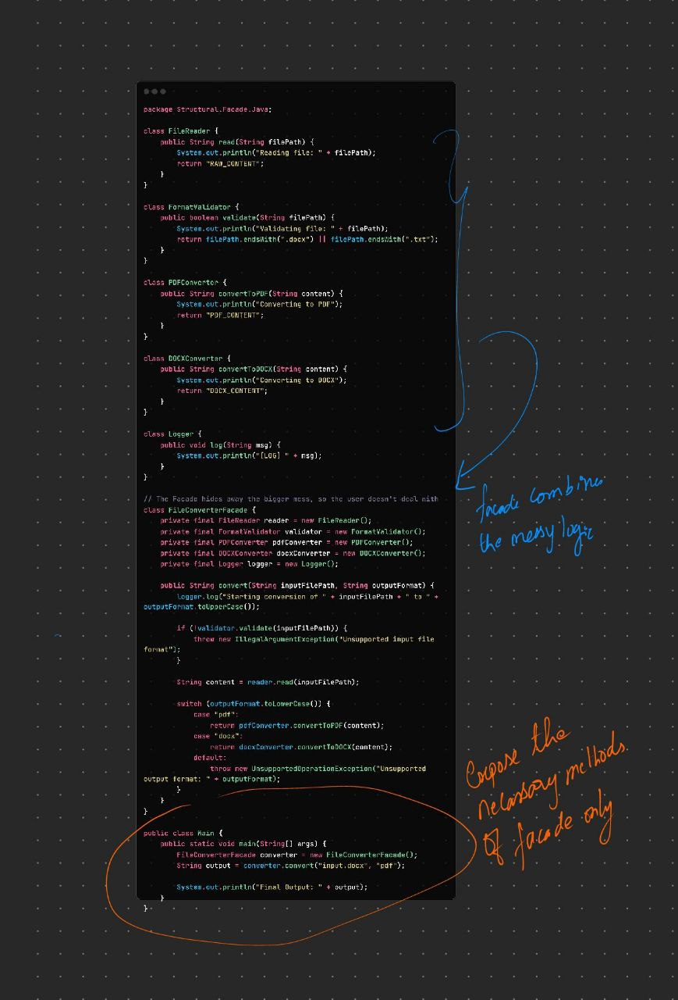

---

# 🧱 Facade Design Pattern — All You Need to Know

---

## 🎯 What is Facade?

The **Facade Pattern** provides a **simple, unified interface** to a **complex subsystem**.

> It **hides complexity** behind a clean, easy-to-use class.
> The client doesn’t need to know how the internals work — just calls the facade.

---

## 🧠 Real-World Analogy

Imagine a **hotel concierge**:

* You want dinner, a cab, and your luggage moved
* You don't talk to the chef, driver, and porter
* ✅ You call the **concierge**, and he delegates internally

That’s the **facade**.

---

## 🔧 Structure

```
Client → Facade → [Multiple complex subsystem classes]
```

---

## 👨‍💻 Java Code Example: Video Conversion API

Let’s say you have a video converter app. Internally, it:

* Loads a video file
* Applies filters
* Converts formats
* Exports it

But you want users to just call one method like: `convert("video.avi", "mp4")`

---

### 1. 🎛 Subsystem Classes (complex stuff)

```java
class VideoFile {
    String filename;
    public VideoFile(String filename) { this.filename = filename; }
}

class Codec { }

class AudioMixer {
    public void mix(VideoFile file) {
        System.out.println("Audio mixed for: " + file.filename);
    }
}

class FormatConverter {
    public void convert(VideoFile file, String format) {
        System.out.println("Converted " + file.filename + " to " + format);
    }
}
```

---

### 2. 🧩 Facade Class

```java
class VideoConversionFacade {
    public void convertVideo(String filename, String format) {
        VideoFile file = new VideoFile(filename);
        Codec codec = new Codec();
        AudioMixer mixer = new AudioMixer();
        FormatConverter converter = new FormatConverter();

        mixer.mix(file);
        converter.convert(file, format);
        System.out.println("Conversion complete!");
    }
}
```

---

### 3. ✅ Client Code (easy to use)

```java
public class Main {
    public static void main(String[] args) {
        VideoConversionFacade facade = new VideoConversionFacade();
        facade.convertVideo("my_movie.avi", "mp4");
    }
}
```

---

## ✅ When to Use Facade

| Situation                                     | Why Facade Helps                           |
| --------------------------------------------- | ------------------------------------------ |
| You have a **complex subsystem**              | Hides internal details and complexity      |
| You want to **simplify your API** for clients | One clean entry point                      |
| You want to follow **Separation of Concerns** | Facade handles coordination, not logic     |
| You have **poorly structured/legacy code**    | Wrap it with a clean facade                |
| You're designing **service layers (Spring)**  | Service layer acts like a facade over DAOs |

---

## ❌ When Not to Use

| Situation                              | Better Approach          |
| -------------------------------------- | ------------------------ |
| You already have a clean, cohesive API | Facade adds no value     |
| Subsystems are unrelated               | No need to group them    |
| You need detailed control              | Call subsystems directly |

---

## ✅ Benefits

* ✔ Simplifies usage for clients
* ✔ Decouples clients from internals
* ✔ Improves maintainability
* ✔ Hides legacy/ugly code

---

## ❌ Drawbacks

* ❌ May become a **God class** if not designed well
* ❌ May oversimplify and hide useful features

---

## 🔁 Facade vs Adapter vs Proxy

| Pattern     | Purpose                                              |
| ----------- | ---------------------------------------------------- |
| **Facade**  | Simplify multiple classes into one entry point       |
| **Adapter** | Make incompatible interfaces work together           |
| **Proxy**   | Control access, add behavior (like caching, logging) |

---

## 💡 Real-World Uses of Facade

| Context               | Facade Example                                      |
| --------------------- | --------------------------------------------------- |
| **Spring Boot**       | `@Service` layer wraps calls to multiple DAOs       |
| **JPA/Hibernate**     | `EntityManager` hides complex SQL & session logic   |
| **Logger frameworks** | SLF4J is a facade over Log4J, Logback, etc.         |
| **APIs**              | `FileUtils.copy()` in Apache Commons wraps IO logic |

---

## 🧠 TL;DR

> **Facade Pattern** is about **providing a clean, simplified interface** to a **messy or complex subsystem**, improving usability and decoupling.

---

### Code Walkthrough



### Summary

The Facade Pattern wraps all the repetitive, low-level, boilerplate, messy orchestration logic into a clean, high-level method that the client can use without thinking.

